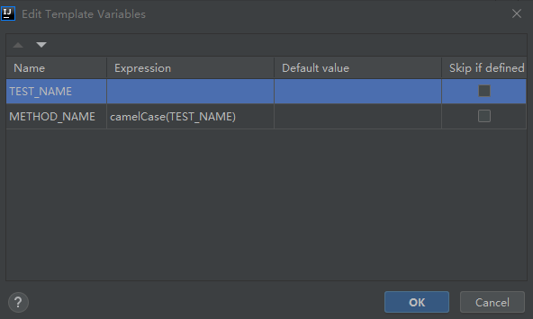

# Intellij idea 
:exclamation: These are MY favorite tips


## Shortcuts
- `Ctrl+Alt+<-/->` back or forward place, `Alt+<-/->` left or right tab
- `Ctrl+Alt+H` search in hierarchy (`ctrl+shift+f`)
- `Ctrl+Alt+L` format current file
- `Ctrl+Alt+S` open settings, `Ctrl+Alt+Shift+S` open project settings
- `Ctrl+Alt+O` optimize import
- `Ctrl+Shift+I` preview implementation 
- `Ctrl+Shift+F10`
- `Ctrl+Shift+Alt+T` show refactoring options
- `Ctrl+B` go to the declaration, `Ctrl+Alt+B` navigate to an implementation
- `Ctrl+C/X` copy or cut the whole line
- `Ctrl+D` duplicate line or selection
- `Ctrl+E` view the most recently opened files
- `Ctrl+N` find classes
- `Ctrl+W` / `Ctrl+Shift+W` increasing or decreasing sections of code near the cursor
- `Ctrl+Y` delete line
- `Alt+F7` find where something is used
- `Alt+1` open/close project window
- `F2` jump to the next error, warning or suggestion.
- `Alt+J` add selection for next occurrence

- `LocalHistory` > `show History`
- `Help` > `Change Memory Settings` > `Edit Custom VM Options`

## Settings
- `Appearance` > `Theme` >> [NEWUI] Gradianto Deep Ocean
- `Editor` > `General` > `Code Completion` >> Uncheck `Match case`, ignore cases for auto-completion
- `Editor` > `General` > `Apperarance` >> Check `Show method separators`
- `Editor` > `General` > `Editor Tabls` >> Uncheck `Show tabls in one row` (`tab limit`)

### Get rid of the pop-up message asking to trust certificate
File | Settings | Tools | Server Certificates for Windows and linux

### `Open File or Project` dialog window hangs in loading state since new UI
It's possible to use a native file chooser on Windows. 
To enable it, add the following properties to the Help | Edit Custom Properties file and restart IDE : 
```
sun.awt.windows.useCommonItemDialog=true
ide.win.file.chooser.native=true
```

### Open declaration source in the same tab
Uncheck `Enable preview tab` in the settings of project view

### Resolve `Symbol ... is inaccessible from here`
Java | Javadoc | Declaration has problems in Javadoc references

Uncheck `Report inaccessible sympols`
## Plugins
- Pokemon progress
- GitHub Copilot
- Rainbow Brackets

## Live template

### Junit test method
```
@org.junit.jupiter.api.Test
@org.junit.jupiter.api.DisplayName("$TEST_NAME$")
void $METHOD_NAME$() {
    // GIVEN
    
    // WHEN
    
    // THEN
}
```


### Parameterized test with value source
```
<template name="pvtest" value="@org.junit.jupiter.params.ParameterizedTest(name = &quot;{index} $SUB_TEST_NAME$ {0}&quot;)&#10;@org.junit.jupiter.api.DisplayName(&quot;$TEST_NAME$&quot;)&#10;@org.junit.jupiter.params.provider.ValueSource($TYPE$ = {})&#10;void $METHOD_NAME$($ARG$) {&#10;    // GIVEN&#10;    &#10;    // WHEN&#10;    &#10;    // THEN&#10;}" description="Parameterized test with value source" toReformat="true" toShortenFQNames="true">
  <variable name="TEST_NAME" expression="" defaultValue="" alwaysStopAt="true" />
  <variable name="SUB_TEST_NAME" expression="" defaultValue="" alwaysStopAt="true" />
  <variable name="TYPE" expression="enum(&quot;strings&quot;,&quot;booleans&quot;,&quot;ints&quot;,&quot;longs&quot;,&quot;floats&quot;,&quot;doubles&quot;,&quot;chars&quot;,&quot;shorts&quot;,&quot;bytes&quot;,&quot;classes&quot;)" defaultValue="strings" alwaysStopAt="true" />
  <variable name="METHOD_NAME" expression="camelCase(TEST_NAME)" defaultValue="" alwaysStopAt="true" />
  <variable name="ARG" expression="" defaultValue="" alwaysStopAt="true" />
  <context>
    <option name="JAVA_DECLARATION" value="true" />
  </context>
</template>
```